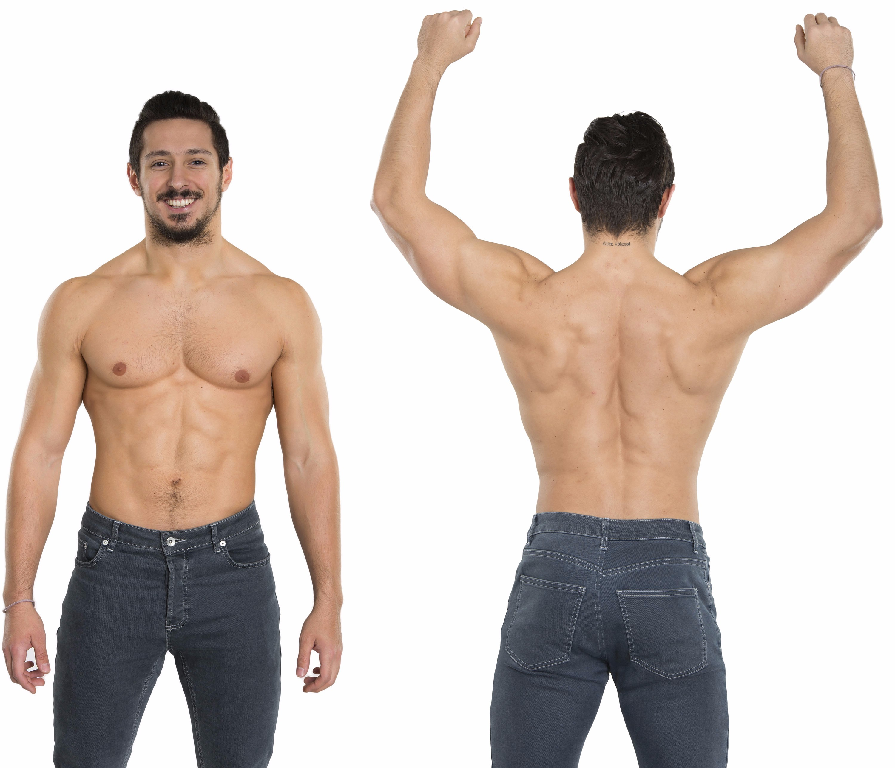
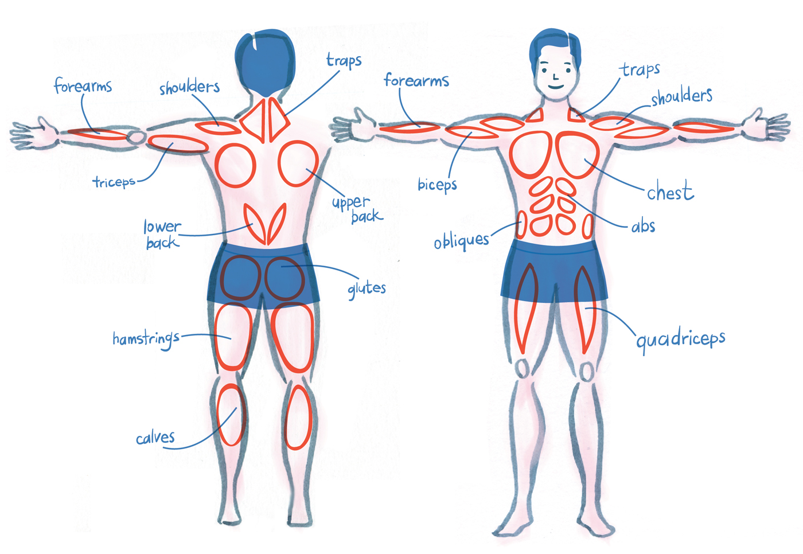

# 锻炼肌肉

> “明年今日，你会希望此时此刻自己已经行动了。”
>   – 卡伦·兰姆

## 多数的健身建议都是误导

本手册是一年以来我通过现代科学能够证明的最有效的肌肉锻炼方法，它适用于任何性别的人。

我写这个指南是因为即使是在 2016 年，许多非正式的健身建议都是未经证实并且带有误导性的。我不能因此责怪大多数的博主，因为在这个指南里的许多观点也还没有被广泛的发表在科学文献之外的地方。

本指南和许多的健身建议相矛盾，比如女性初期难以获得肌肉增长，锻炼休息时间应该在 1-3 分钟之间，你应该定期变换你的锻炼，通过机器练习不如哑铃有效等等。

在本指南中我会始终通过引用学术研究来支持我的观点，并且教你如何测量你的每周肌肉增长量以使你确定你的肌肉有所增长。

说到肌肉增长，一个刚入门的锻炼者在严格执行这个计划的情况下，在三个月内可以增长约 9 千克（20 磅）的肌肉（在此之后增长速度将大幅减缓）。每个人都可以做得到这一点，基因不好也并不会影响到你能否增长这 9 千克的肌肉，这是我们未来还要深入的问题。

除了做到了科学严谨，本指南同时也很全面，我不会只告诉你 75% 你想要知道的东西然后使你仍然心存疑问。为了使本指南成为完善的肌肉锻炼参考，我已经花了一年时间来调整这个营养和锻炼计划。

我们将会了解到关于这几个方面的内容：
> - 我们应该吃什么以使肌肉增长。
> - 什么是最好的锻炼计划。
> - 如何测量你的每周肌肉增长量。
> - 怎样克服瓶颈。

看到这里你应该已经心动了，如果你之前不想花上一两年的时间去体育馆锻炼出一身肌肉，那么恭喜你，现在你可以只用 3-4 个月达成这个目标。

再忍耐一下，我知道这听起来像是电视广告，但是你会对这个指南印象深刻的。如果你看完这个指南以后还是感到怀疑，你可以到我的 [Twitter](http://twitter.com/shapiro) 上来骂我傻瓜。

最后我要说明一下，这个手册是完全免费的。

## 关于作者

咋了? 我是 [Julian.](http://twitter.com/shapiro)

我为了用简洁的表述解释一些复杂的话题，经过深入的研究，写出了这些手册。

每份手册都比你书架上能找到的东西更加 **简洁** ，**有效**。而且这是免费的哦。

以前, 我是一名创业者. 我的作品被展示在 [Forbes](http://www.forbes.com/sites/alextaub/2015/06/18/major-contributor-to-open-source-technologies-julian-shapiro-pulls-back-the-curtains-on-saas-usage/#7f882fc7985e), 我出过 [书](https://www.amazon.com/Web-Animation-using-JavaScript-Develop/dp/0134096665), 我写过很受欢迎的 [开源库](https://github.com/julianshapiro/velocity), 还 [开过](http://thenextweb.com/apps/2011/08/05/find-a-great-domain-name-for-your-startup-without-paying-the-earth-with-namelayer/#gref) 并且[卖掉](http://venturebeat.com/2013/09/24/techstars-buys-namelayer-to-save-its-startups-from-awful-domain-names/) 了一家公司.

我还有另一份关于如何 [初创业](https://www.julian.com/learn/growth/intro)的手册.

## 适用于每个人的健身意见

本指南涵盖了如何增长肌肉的普遍原则。

如果你是刚入门的锻炼者，你将会学到如何增长 9 千克（20 磅）的肌肉；如果你是中阶锻炼者，你将学会如何突破瓶颈；如果你打算变得更加强壮而不是更加庞大，本指南的 95% 都适用于你。

## 我能增长多少肌肉？

让我们来确定一个贴合实际的期望值以免完成训练以后感到失望，同时也通过每周的肌肉增长给你持续的锻炼动机。

首先选择你的性别以查看相应的内容：

[我是男性](#我是男性)

[我是女性](#我是女性)

### 我是男性

#### 男性身体范例

看看下面这个身材， [下载](../images/Male Body Target 1.jpg) 下来这张图片并且在你需要动力的时候看一眼:

这是一个对于平均体型男性可以在锻炼四个月后达到的效果。查尔斯看起来很健康，他的肌肉质量会让大多数女性喜欢，并且它不需要类固醇的帮助便能锻炼成这样。（如果你已经比这个例子更加强壮，我将会教你如何突破瓶颈变得更加强壮。）

**再重复一遍：任何没有疾病，年轻的成年男性在短短几个月的锻炼后都能在不需要类固醇的帮助下达到上图的水平。**

如果你从完全的脆弱的身子练起，三个月后你将会变成这样：

或者如果你已经比较强壮，你可以通过努力变得更加强壮：

注：想要变得比上图明显强壮需要几年的锻炼，在几个月的锻炼后想要继续增长肌肉会变得更加困难，你不断增长的强壮肌肉需要不断增加的更高的刺激。当你进入这个阶段后，你每年大概会增长 0.9 千克（2 磅）的肌肉。

注意这上面的所有人都有少量的体脂，用于帮助转换为肌肉。事实上你并不会通过举重减少脂肪，因此减肥是另一件独立的事情。
如果你变强壮的目的是吸引女性，这里是一个可行性检测：大多数女性认为上图的身材比起健身杂志上的更加吸引人，这已经是定论了（[相关研究](http://journals.plos.org/plosone/article?id=10.1371/journal.pone.0050601), [相关研究](http://dfred.bol.ucla.edu/FrederickFesslerHaselton2005MuscularityInMagazines.pdf)）： 女性将拥有巨大的肌肉的男性比作化过多妆的女性，意思在于这有些太过头了。

换言之，女性更喜欢左边这幅图这样的。

（还是不信？让你的女性朋友来投个票吧。）

>因此如果你的目的是达到可以吸引女性的身材, 通过本指南你只需要几个月时间就能实现。

但是回到之前提到的体脂问题，要知道女性还是会认为越低越好。

#### 类固醇

尽管这个效果更加贴合女性的喜好，你可能仍然感到好奇那些好莱坞超级英雄是如何变得如此强壮的。 事实是：大多数的超级英雄扮演者 [在使用或以前使用了](http://www.hollywoodreporter.com/news/hollywood-steroid-use-a-list-609091)  [类固醇](https://www.t-nation.com/steroids/steroids-what-pro-bodybuilders-are-really-using], [胰岛素][https://www.t-nation.com/diet-fat-loss/insulin-advantage)，或 [生长激素](http://www.health.harvard.edu/diseases-and-conditions/growth-hormone-athletic-performance-and-aging) — 这些可都是可能导致严重健康问题的。不然怎么可能在短短几年内从平均身材成长为 [雷神尺寸](https://www.youtube.com/watch?v=zLxEDaA9j2E#t=0m30s)™ 呢？

所以让这些名流淡出你的目标吧，你被骗咯。

A discussion of what is natural to attain should touch upon natural bodybuilding competitions, wherein contestants are not permitted to use steroids. Here are [some such contestants](http://www.bodybuilding.com/contest_media/6472/0/d/2008fitnessatlanticnovicelightweight671216831169.jpg). However, recognize that their muscles are accentuated by tans, vascularity, low body fat, and having done pushups right before walking onto the stage. Also notice how they have thick torsos and broad shoulders — these men are outliers with big frames. And, certainly, they've put in years of incredibly hard work.

But here's the more insidious aspect: "Natural" doesn't always mean you can't take other substances like HGH and insulin, which hugely benefit muscle growth. (You can read amateur breakdowns of cheating [here](https://www.t-nation.com/training/how-natural-is-natural-bodybuilding), [here](http://nattyornot.com/steroid-using-bodybuilders-pass-drug-tests/), and [here](http://nattyornot.com/bodybuilders-steroids-compete-natural-shows/). While not investigative, these reports present evidence for how easy it is to circumvent "natural" competitions.)

All of this is to once again hammer in that you must throw out the physique targets beat into you by pop culture and local gym rats if you want to build naturally.

What exactly do the results of steroids look like? Well, the model below has chest and shoulder muscles that are unnaturally large relative to his bone size. This relative size is not possible without artificial help. If your goal is to look like this or bigger, that's fine, but just know that you're not getting there naturally.

#### 男性的最大肌肉尺寸

我们还没有回答关于我们能自然获得多大尺寸肌肉的问题。

Check this out: Researcher [Casey Butt](http://www.weightrainer.net/index.html) performed a fascinating analysis on the muscle size of the world's top male bodybuilders ([source](http://www.weightrainer.net/potential.html), [study](http://www.ncbi.nlm.nih.gov/pubmed/7496846)). He used data from the pre-steroid bodybuilding era, which means it reflects how muscular males can get naturally. We'll use his results to approximate the maximum size we can weigh at [10% body fat](https://paper.imgix.net/https%3A%2F%2Fd2mxuefqeaa7sj.cloudfront.net%2Fs_47BA25183F58123E5E1B386359348E6870986C628A36A91739F8545AFA7EFAAB_1468603592749_Male%2BPart-way%2BBody%2BTarget.jpg?auto=format&ixlib=js-0.2.1&s=8d542b39daff90e747952506b650c4a6).

我把Casey的公式转换成了一个计算器，仅适用于男性：

- @todo calculator here

To measure the circumference of your ankle and wrist, wrap [body tape](http://a-fwd.com/es=juliancom09-21&fr=juliancom06-21&de=juliancom0c-21&uk=juliancom-21&ca=juliancom0d-20&com=juliandotc059-20&asin-es=B01B9EJBB4&asin-fr=B01G1HPD4I&asin-de=B00YC7PJAI&asin-uk=B000G7YW7Y&asin-ca=B000KBFCG6&asin-com=B000KBFCG6) around the parts indicated in the images below:

> “Enthusiasm is more important than skill because the critical element in developing expertise is the desire to practice.”
>   – Gretchen Rubin

[Jump the Female Part](#julian-after-three-months)

### 我是女性

#### 女性身体范例

这是两个体脂较低的女性，你可以清楚地看到她们肌肉：

第一个女性很*瘦*（看她脆弱的胳膊）而第二个女性很*健美*。

（除此之外，如果你需要更多的激励，看 [这里](https://www.instagram.com/achieving_balance/) 还有 [这里](https://www.instagram.com/blogilates/)。）

Notice I’m not using the word “toned," which isn’t a thing. When a muscle is exercised, it responds by getting bigger, but it can’t stay the same size and just get harder. So when people use the word “toned," they’re referring to the combination of (1) being thin enough that muscle definition is visible and (2) having muscles to begin with.

You might not want to get as muscular as the second woman, but getting just halfway there will still make an enormous difference in your physique. 

If you only want to be muscular in a certain areas, this program provides a workout plan for only growing your arms (biceps and triceps), abs, butt (glutes), and hamstrings. Not sure what those are? The illustration below is applicable to both women and men:

#### Women gain muscle as fast as men

The limiting factor to how big you can get is the broadness of your skeleton ([study](http://ajcn.nutrition.org/content/75/6/1012.long)). So if your body is on the smaller side (e.g. high school teenager), it will be impossible to reach the same maximum muscle mass as someone much bigger than you. In other words, the average woman will ultimately gain less muscle than the average man.

But this doesn't mean women reach their maximum muscle size at a slower rate. In fact, women develop muscle at the same rate as men ([study](http://www.ncbi.nlm.nih.gov/pubmed/11890579?dopt=Abstract), [study](http://www.ncbi.nlm.nih.gov/pubmed/7558529), [study](http://www.ncbi.nlm.nih.gov/pmc/articles/PMC2991130/)). (Hat tip to [Menno Henselmans](http://bayesianbodybuilding.com/natural-muscular-potential-women/) for compiling this research.) The difference is that women start with less muscle mass on average and ultimately gain less.

> Even if you have an above-average sized frame, don’t be concerned about "accidentally" building lots of muscle too quickly. You’ll notice muscle gains early enough in the process to avoid getting “bulky.”

Yes, men have more testosterone, but testosterone is less important to the female muscle development process. In fact, women benefit from higher levels of IGF1 growth hormone, which is critical to muscle growth ([study](https://www.researchgate.net/publication/49661582_Circulating_levels_of_IGF1_are_associated_with_muscle_strength_in_middle-aged-_and_oldest-old_women), [study](http://press.endocrine.org/doi/abs/10.1210/jcem.81.7.8675561)). 

While there are fewer muscular women in the world, that’s a reflection of fewer women working to become very muscular — due to societal expectations. It’s not a reflection of it being more difficult for women to actually build muscle. You may have a hard time believing all this, so click on any of those studies to skim the research. 

It’s important you understand that you're not at a disadvantage when bodybuilding because thinking otherwise can deter your progress. For example, one study examined the opposite scenario, where men were tricked into thinking they were taking steroids when they weren’t, and they consequently lifted 350% more in weight ([study](http://jamesclear.com/wp-content/uploads/2015/07/anabolic-steroids-the-physiological-effects-of-placebos.pdf), [study](http://www.ejmh.eu/mellekletek/2011_2_196_Berdi_etal.pdf))! 

#### 塑造臀部

你不需要有氧运动，瑜伽或者健美操帮助你塑造你的臀部。你只需要通过重量按照正确的健身计划来塑造。

尤其是下蹲练习对你的臀部塑造很有帮助。

没有其他的什么塑造臀部的秘密，臀部和其他地方的肌肉一样，你需要锻炼 8-10 下每次并且每次都使用越来越大的重力。

> “Enthusiasm is more important than skill because the critical element in developing expertise is the desire to practice.”
>   – Gretchen Rubin

## 三个月后的 Julian

下面这些照片是我九十天运动计划前的照片。 如果在九十天后你继续执行这个计划两三个月，你可以显著的变得比这样更加强壮（不过五六个月后你每年大概会只能增长 0.9 千克（2 磅）肌肉）

在这九十天里我的胳膊从 28 厘米增长到了 34 厘米。

最后我会把读者的转变照片放上来，请把你们的照片发送到[这里](mailto:submissions@julian.com?subject=Reader%20Transformation%20Photos)。

@todo add2photos

## 不要为不运动找借口

如果你一直拖延你的节食计划因为你不断的告诉自己“让我今晚再吃一点甜品，我明天会开始节食的。”这样你就会进入一个恶性循环，这种循环同样也可能发生在剑身上。

无论承诺与否，不要欺骗你自己。

让我们先来解决一些你潜在的顾虑：

> - **曾经有过无法执行的经历？** 找一个生活中你最敬重的人，一个你不想让 TA 认为你是个半途而废的人的人，告诉他们你的九十天健身计划并且让他们监督你。创建一个从现在开始为期三个月的规划表并把他们包含在内。
> - **太懒以至于不想去练习体育馆？** 我将会教你如何在家锻炼。
> - **担心这会花费太多时间？** 男性达到 [这个体型](https://daks2k3a4ib2z.cloudfront.net/54a5a40be53a05f34703dd18/57939ede412fc21f2b6577b3_s_47BA25183F58123E5E1B386359348E6870986C628A36A91739F8545AFA7EFAAB_1468603190221_Male%2BBody%2BTarget%2B1.jpg) 就能够最大程度的吸引女性。这会花费你大概九十天时间，你并不需要变得过于体型庞大。
> - **不知道如何规划运动时间？** 比以前早起一小时，在一天开始前运动。
> - **没有时间？** 想要变得强壮只需要花费你每周三个一小时的时间，来吧。
> - **去体育馆让你感到尴尬？** 在你当地的体育馆参加一些训练课程来学一些正确的姿势。
> - **担心自己没有天赋？** [零基础](https://twitter.com/Shapiro/status/767431595112345600)的人就可以健身。你并不需要是一个运动员。如果你可以把食物放入嘴中，可以拿起杂物，你就可以锻炼。 人类的身体本来就可以做这些事情。

> 我最喜欢的激励自己去体育馆的方式就是在我运动时听自己最爱听的音乐或者广播。

难道你不想当你起床时，看着镜子可以问心无愧的说一句“这看起来很棒。”嘛？ 你距离这个目标只有九十天，赶紧去在你的日历上标注好。然后让你的所有朋友为你这个三个月的转变大吃一惊。

所以不要再拖延啦，让我们开始做吧。

这是最后一个小激励，听这个视频里提到的词语：

https://cdn.embedly.com/widgets/xcomm.html#name=media&sid=f37e6a4a83ad4cbd80aa7390f9f0e4e9

> “Never drop the ball pursuing a goal just because of the time it takes. That time will pass by anyway.”
>   – Earl Nightingale

## 指南概览

只要你想不断地增长肌肉, 这个计划都要求你每周去三次体育馆，每次 45-60 分钟。当你达到目标体型以后，你可以转换到维持计划，即每周两次，每次 40 分钟。

下面是这个指南的各个部分：

**预备周**

> - 购买锻炼器材。
> - 为自己拍照。
> - 养成良好的睡眠习惯。

**锻炼**

> - 前两个月：少量且大多数人都能做到的运动，哪怕你只有哑铃。运动大概持续 45 分钟。你不需要把自己推向一个困难的境地因为你没有锻炼过的肌肉会很快有所反映。
> - 两个月后：这是为了那些想要肌肉变得越来越大的人而准备的阶段，这个计划由大量高强度的锻炼组成，这对于你的肌肉的持续增长很重要。

**After the following disclaimer, we can move onto the next section: Prep Week!**

## Medical disclaimer

You are not on the website of a medical doctor, nutritionist, or registered dietitian. The opinions expressed on this website, including texts, images, and videos, are generalized. They are presented “as is” for informational purposes only without warranty or guarantee of any kind. Julian Dot Com, LLC (“we”, “our”) makes no representation and assumes no responsibility for the accuracy of information contained on or available through this website, and such information is subject to change without notice. We are not liable nor claim any responsibility for any emotional or physical problems that occur directly or indirectly from reading this website. We are of the ability and use of conversation as per [articles 9 and 10](http://www.ncleg.net/EnactedLegislation/Statutes/HTML/BySection/Chapter_90/GS_90-368.html).

You are encouraged to confirm information obtained from or through this website with other sources. Our content is not a substitute for qualified medical advice. The supplement summaries on this website may not include all the information pertinent to your use. Before starting a diet, taking new supplements, or beginning an exercise program, check with your doctor to clear any lifestyle changes. Only your doctor can determine what is right for you based on your medical history and prescriptions.

Never disregard or delay seeking professional medical advice or treatment because of something you read on this website. In case of medical emergency, contact your doctor and/or call 911 immediately. Again, you are not receiving professional medical advice.

## Continue to prep week

Prep week is the pre-workout phase that eases you into the bodybuilding lifestyle. By going through it, you're much less likely to quit on your bodybuilding goals.

# [Next →](Prep.md)